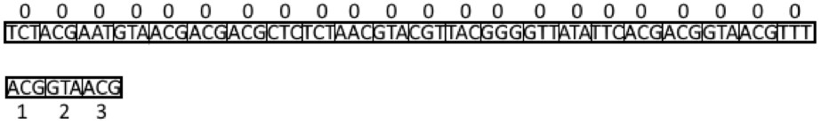
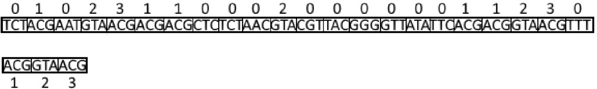
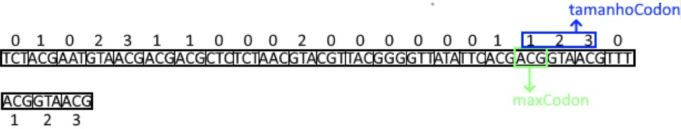
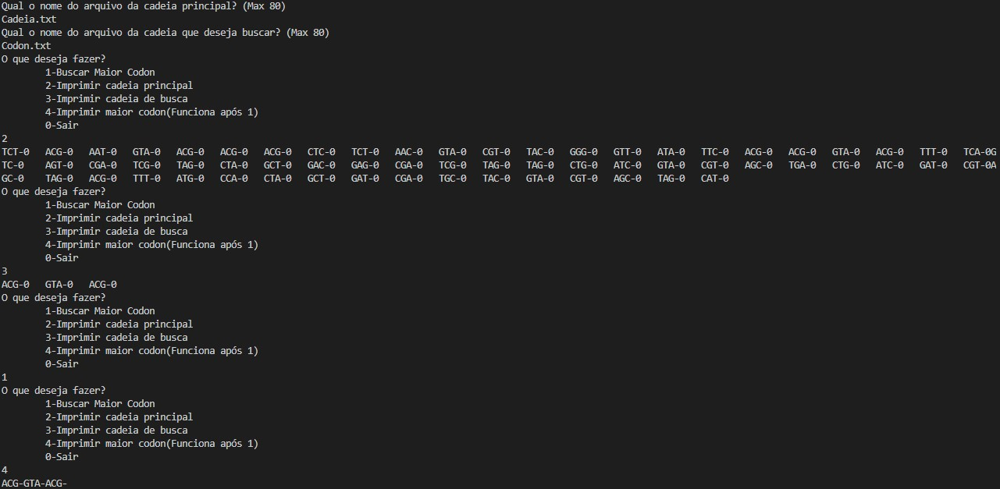
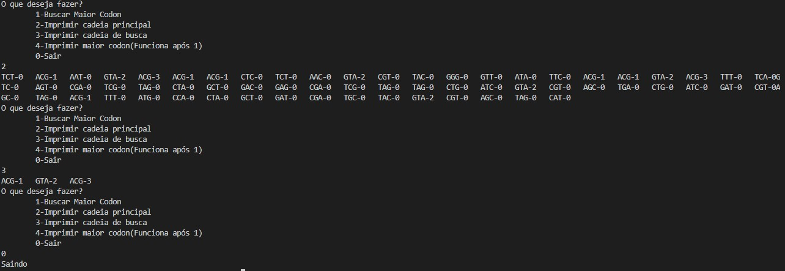

# DNA_List
O problema da máxima cadeia. Elabore um programa que receba uma cadeias de DNA. Cada posição da cadeia deve conter um códon, ou seja, uma triade de nucleotídeos → T, A, G, C. Feito isso, leia de um arquivo uma sequência de nucleotídios (i.e., ACGTGGCTCTCTAACGTACGTACGTACGGGGTTATATTCGAT) e tente identificar a maior cadeia da lista que se relaciona a essa entrada.
# Logica
Foi-se feito um programa com a seguinte lógica:    
Existe uma lista dinâmica **l** e uma **codon** da maneira (Baseado de : [vide git](https://github.com/mpiress/dynamic_list)):
>

>A lista dinâmica é uma variante do modelo estático [vide git](https://github.com/mpiress/linear_list). Assim, antes de apresentar as modificações existêntes nessa implementação, vejamos uma representação gráfica do modelo dinâmico em questão. Observe as nomenclaturas utilizadas na figura, essas são utilizadas na implementação fornecida, as quais podem estar definidas/parametrizadas no idioma inglês.
>

>

>	 
>

>

>Note pela figura que, o primeiro bloco armazenado em RAM não apresenta o tipo dado como parte da estrutura, mas sim um valor 0 <b>"simbólico"</b>. Isso porque é >preciso inserir na estrutura o que chamaremos de cabeça da lista. A cabeça de uma lista nada mais é que um ponteiro <i>vazio</i> (i.e., um tipo similar ao void) que >indica qual posição de memória será utilizada como base/início da lista. 
>

>

>Uma outra nomenclatura a ser observada na figura é a existência de um ponteiro <b>prox</b>. Este tem por objetivo apontar para o próximo bloco de memória que conterá >o novo dado ou para NULL, o que facilita a navegação entre os blocos e a idenficação do fim da lista. Este ponteiro se mostra imprescindível, uma vez que abandonamos >o modelo sequencial de memória e adotamos um conceito cujos blocos estão em endereços aleatórios. Nesse novo modelo, inserções, remoções, pesquisas e impressões da >lista são apoiadas por dois outros ponteiros, o <b>primeiro</b> e o <b>último</b>, conforme representação da figura.
>

>Qual a função dos ponteiros <b>primeiro</b> e <b>ultimo</b>?
>
>Como a lista é composta de blocos espalhados na memória, torna-se necessário identificar qual bloco representa a cabeça da lista. Para isso, é utilizado o ponteiro primeiro. Da mesma forma, identificar o último bloco também se torna importante, uma vez que, novas inserções são realizadas sempre no final dessa estrutura com o objetivo de facilitar sua manipulação.
>

>Se considerarmos um computador hipotético com 8Mb de RAM distribuídos em dois pentes de 4Mb cada, uma representação da lista dinâmica poderia ser compreendida da seguinte forma:
>

>

>	 
>
 

1) Ao entrar no programa a primeira função encontrada é *FLVazia(&l)* e *FLVazia(&codon)* (Baseado de : [vide git](https://github.com/mpiress/dynamic_list)):
>Função responsável por criar um espaço de memória para ser a cabeça da lista. Para tanto, é utilizado a chamada de função nativa do C/C++ malloc, o qual recebe como referência o espaço a ser reservado por meio da diretriz sizeof. Nesse primeiro momento, o casting (i.e., conversão de um tipo void criado pelo malloc para um tipo específico) se torna opcional, sendo utilizado na codificação apenas para manter um único padrão de definição de função. Como pode ser observado no código disponibilizado, o endereço produzido pela execução do malloc é copiado para o ponteiro primeiro e último, mantendo ambos no mesmo endereço. O que significará que a lista se encontra vazia. Por fim, apontamos o prox de ambos os ponteiros para NULL.    

Além de setar o atributo **pos**(posição) de cada elemento como 0;

2) A segunda função *preencheLista(&l,arquivo)* *preencheLista(&codon,arquivo)* tem o objetivo de preencher **l** com a cadeia principal, e **codon** com a cadeia de busca, pegando o nome de arquivos de formato;
>a1
>a2
>a3
>...
>an
>
>onde *a* é um char

percorrendo o mesmo (caso válido, caso inválido da exit) e inserindo elementos na lista, a primeira ação a ser realizada é reservar espaço em memória para esse novo dado. Para isso, o apontador cauda deve apontar em memória para o endereço do novo bloco cujo prox apontará para NULL.

3) A seguir é apresentado um menu para o usuário com as seguintes opções:    
- 1-Buscar Maior Codon:
1. O programa seta uma ponteiro *codons* igual à cabeça da cadeia de busca (codon->cabeca), percorre essa lista (codons=codons->prox) e seta a posição de cada elemento em sequência 1,2,3,... .

	 

  
2. Reseta o valor de codons para à cabeça da cadeia de busca, e entra em um looping que possui um looping interno que percorre a cadeia principal buscando quais codons são iguais ao codon da cadeia de busca, e igualando as posições de cada elemento da cadeia principal ao seu correspondente na cadeia de busca.

	 

 
3. Começa um looping na cadeia principal *aux=l->cabeca* que se a posição do elemento atual for igual a *i+1*, que seria o primeiro codon dessa iteração do looping, se iniciará um looping interno que verifica se os próximos elementos são iguais na cadeia de busca na cadeia principal. Percorrendo assim a lista completa e selecionando o códon que começa a maior sequência **maxCodon->prox** e o tamanho da mesma **tamanhoCodon**.

	 

 

- 2-Imprimir cadeia principal:
    1. Imprime a lista de codons presentes na cadeia principal, se impresso antes da busca mostra posição como 0 para todos, se impresso depois da busca imprime a posição relacionada com a posição de cada codon da cadeia de busca;

- 3-Imprimir cadeia de busca:
    1. Imprime a lista de codons presentes na cadeia de busca, se impresso antes da busca mostra posição como 0 para todos, se impresso depois da busca imprime a posição de cada codon em sequencia de 1 a n (n sendo o ultimo codon);

- 4-Imprimir maior codon(Funciona após 1)
    1. Imprime o valor de **maxCodon->prox** e dos seus seguintes **tamanhoCodon** vezes;

- 0- Sair:
    1. Sair do programa.

Obs.:    
- O arquivo deve ser dado na mesma maneira que o apresentado e deve conter apenas números inteiros
- As entradas devem ser de cadeias que possuem um total de caracteres múltiplo de 3
# Exemplo de execução
Arquivos:    
Cadeia.txt:     
TCTACGAATGTAACGACGACGCTCTCTAACGTACGTTACGGGGTTATATTCACGACGGTAACGTTTTCAGTCAGTCGATCGTAGCTAGCTGACGAGCGATCGTAGTAGCTGATCGTACGTAGCTGACTGATCGATCGTAGCTAGACGTTTATGCCACTAGCTGATCGATGCTACGTACGTAGCTAGCAT      
       
Codon.txt:      
ACGGTAACG     
      
Execução:

	 

	 

 

# Compilação e Execução

O programa possui um arquivo Makefile que realiza todo o procedimento de compilação e execução. Para tanto, temos as seguintes diretrizes de execução:

| Comando                |  Função                                                                                           |                     
| -----------------------| ------------------------------------------------------------------------------------------------- |
|  `make clean`          | Apaga a última compilação realizada contida na pasta build                                        |
|  `make`                | Executa a compilação do programa utilizando o gcc, e o resultado vai para a pasta build           |
|  `make run`            | Executa o programa da pasta build após a realização da compilação                                 |
